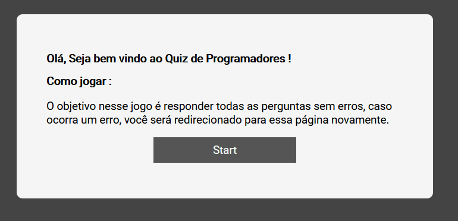
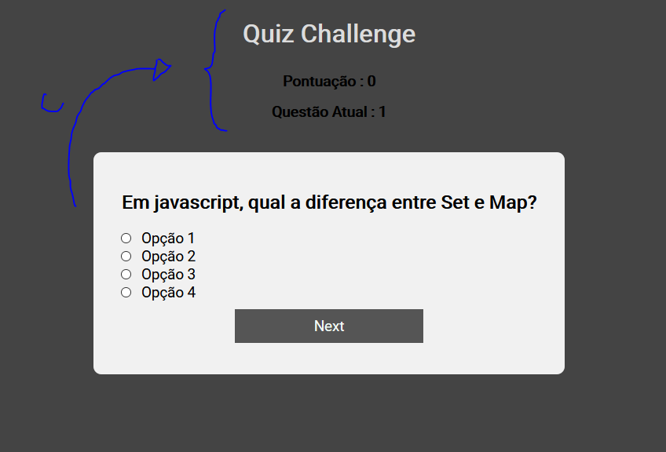
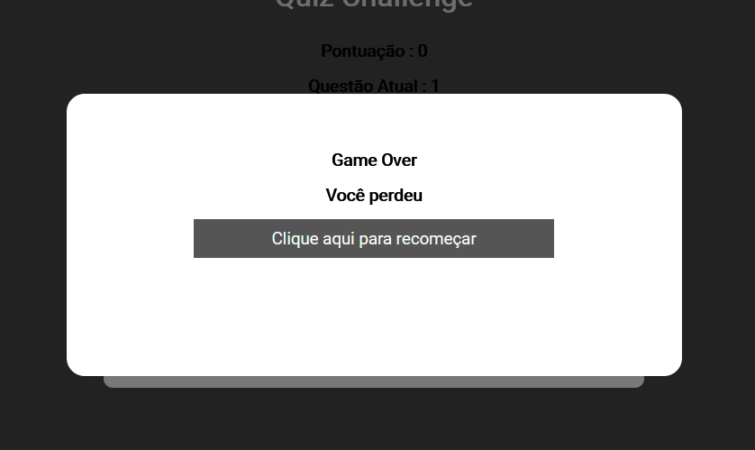
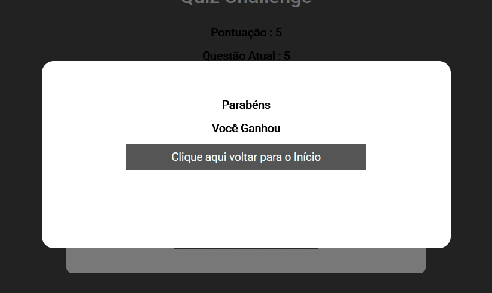

# Quiz Challenge

O jogo deve começar com uma tela que contenha uma mensagem de boas vindas e um botão "Iniciar Jogo". Após o usuário clicar neste botão, a tela de boas vindas deve sumir e deve aparecer a primeira pergunta. Caso o usuário acerte, a próxima pergunta deve ser mostrada. Caso ele erre, um overlay preto (com a transparência a sua escolha) deve ser mostrado sobre a interface, com uma mensagem que ele perdeu o jogo e com um botão para que ele recomece o quiz. Caso ele acerte todas as perguntas, a interface deve mostrar uma mensagem parabenizando-o e um botão para que ele recomece o jogo.

## Tecnologias

- Foi utilizado React JS para construir a interface.
- lib *react-router-dom* para tratar as rotas da interface.

## Conceitos de React JS aplicados nesse projeto

- Components
- State
- Props
- Comunicação entre Components
- Ciclo de Vida de um Component

## Instalação

Quiz Challenge requer o [Node.js](https://nodejs.org/) v10+. Para mais agilidade na instalação das dependênicas, recomendo o uso do yarn como gerenciador de dependênicas.

Para instalar as dependências da aplicação :

```sh
cd interface-quiz
yarn install
```

Para iniciar a aplicação :

```sh
yarn start
```

Para acessar a interface é só acessar em seu navegador :

```sh
http://localhost:3000/
```

## Telas da Aplicação

### Tela de Início 


### Tela principal


### Tela Game Over


#### Tela Ganhador
